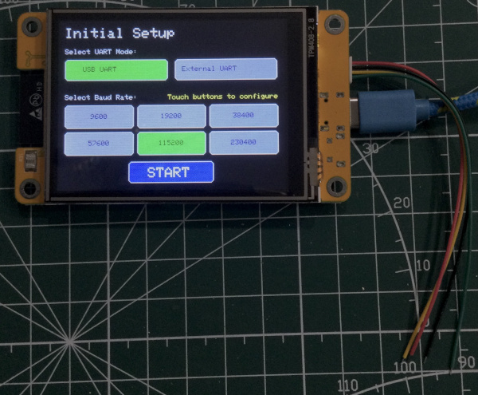
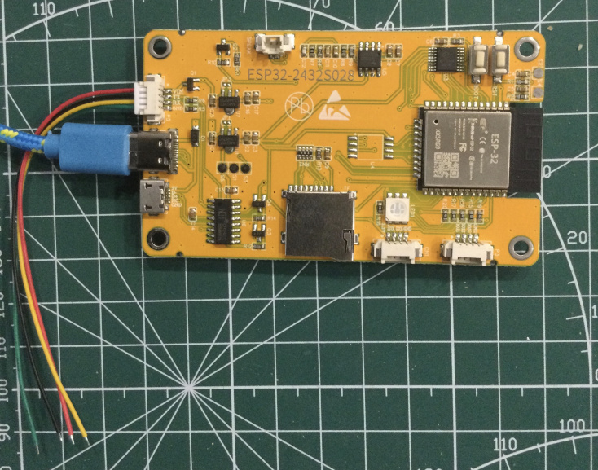

# CYD_Terminal
Cheap Yellow Display (CYD) Serial Terminal  
    
    
This project was modified from the original at https://github.com/CheshirCa/CYD_terminal  
It was changed as needed to use the ILI9341 display instead of ST7789 and to
allow different SPI pins for the display driver and the touch interface controller. 
The original project assumed both were using the same SPI bus
  

There are several different versions of the CYD. 
The one used in this project has a 2.8" display and uses the ILI9341 display driver.   

To use:  

Make sure the TFT_eSPI library is installed in the Arduino IDE.  

Copy the file User_Setup_CYD_ILI9341.h from the sketch folder to the Arduino library folder where TFT_eSPI is installed. 
This will tell the TFT_eSPI library which pins and other configurations to use. 
Edit the User_Setup_Select.h file in the TFT_eSPI library folder and add the line  
   #include <User_Setup_CYD_ILI9341.h>   
while commenting out any other #include lines for other User_Setup files (only one user setup file should be included).   

To calibrate the touch screen coordinates before initial use,  
edit the file XPT2046_Bitbang.cpp and change 
#define RERUN_CALIBRATE false  
to  
#define RERUN_CALIBRATE true   
This will force touch calibration upon power up and the settings will be saved on the module. 
Instructions will appear in the serial monitor, instructing the user to tap and hold the upper left corner, then the lower right corner of the display to get the calibration data.  
Once calibrated, change back to  
#define RERUN_CALIBRATE false  
and upload the sketch again so it will continue using the saved touch calibration data without forcing re-calibration upon power up.  

If the display has inverted colors, edit display.cpp and look for the line  
 tft.invertDisplay( true );  
 Comment or uncomment the line as needed to get the colors correct.  
